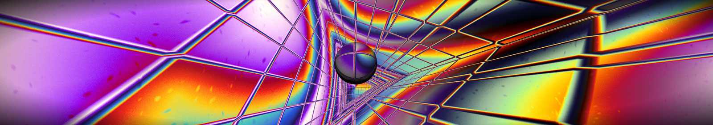
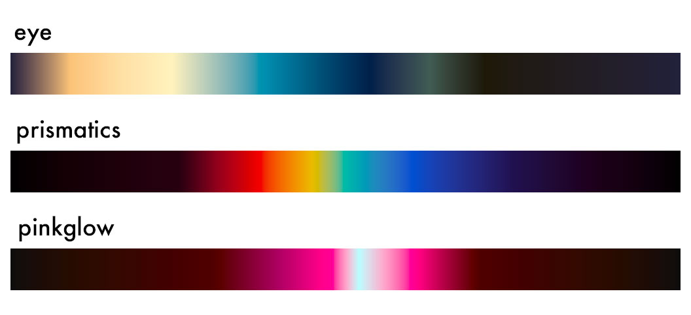
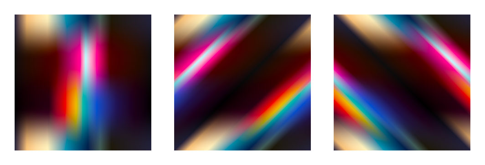
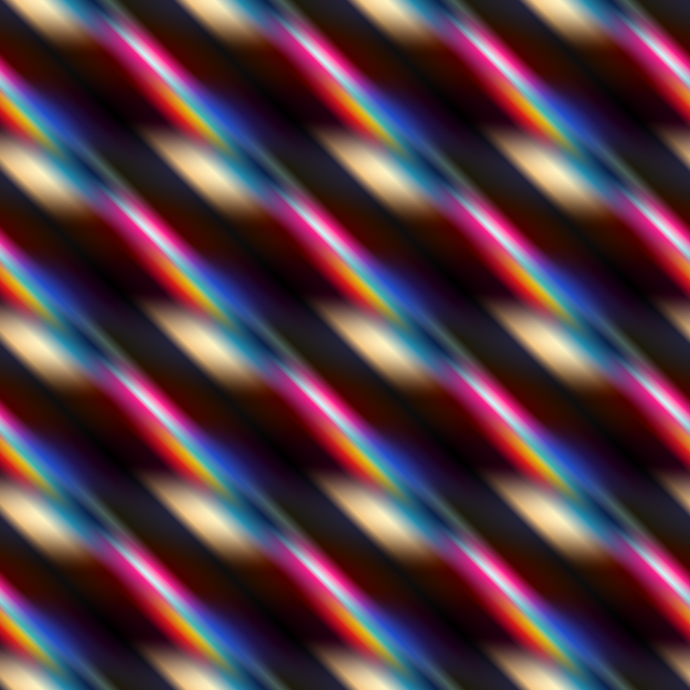
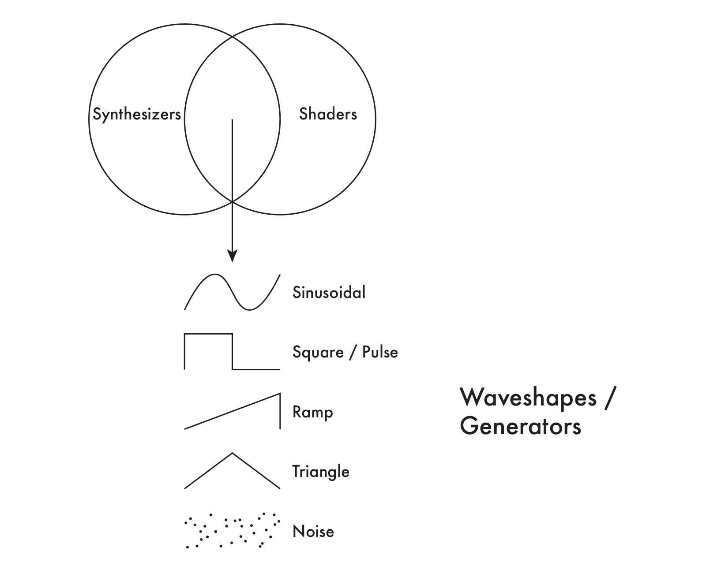
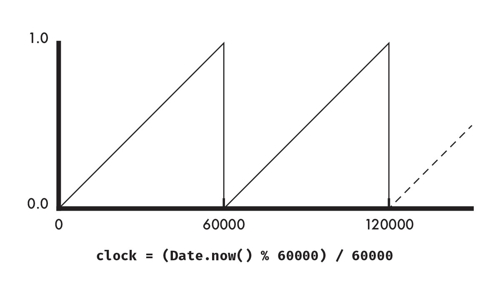
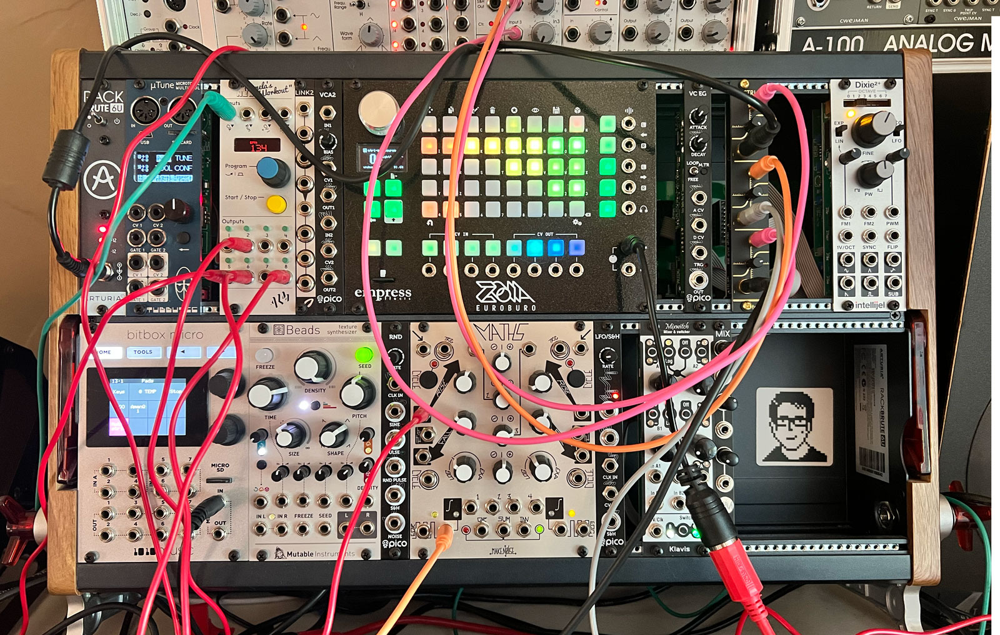
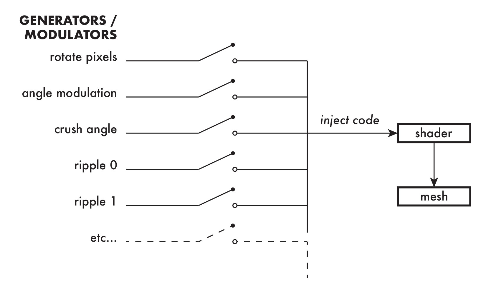
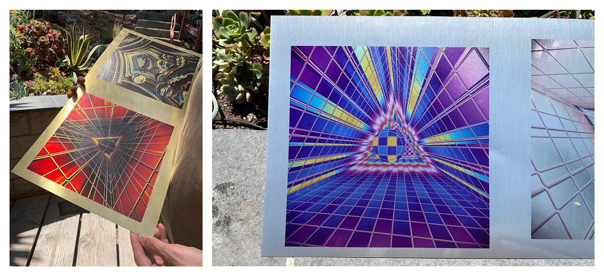

# Invisillations



Generative Art by Jacob Joaquin

Email
me@jacobjoaquin.com

For Art Blocks Artist Application

---

## Links

*Invisillations* Prototype — [invisinode.vercel.app](https://invisinode.vercel.app)

Portfolio — [jacobjoaquin.myportfolio.com](https://jacobjoaquin.myportfolio.com)

Instagram — [instagram.com/jacobjoaquin/](https://www.instagram.com/jacobjoaquin/)

Foundation — [foundation.app/@jacobjoaquin](https://foundation.app/@jacobjoaquin)

---

## Abstract

Meditating peacefully in quiet, thoughts arise about invisible oscillations continually flowing through ourselves and space. Radio, television, cellular data, Wi-Fi, mystical shadows from higher dimensions; ever-present signals imperceptible by our senses.

This piece brings light (and color) to this phenomenon, elevating awareness of hidden yet always present vibrations through a series of generative animations.

---

## The Core Elements

Digital oscillations existing in a volume, manifesting as cross-sections of color and motion as they intersect primitive geometries.

At the core of *Invisillations* is the color table oscillator, a two-dimensional looping manifold modulated in 3 spatial dimensions and 4th dimension of time. Fundamental signal types sine, saw, pulse, triangle, and noise generate color, movement, and optical dissonance. 

--- 

## ThreeJS

The Invisillations prototype is created with ThreeJS r124, making use of geometric primitives, meshes, and custom shaders, as well as synthesizer fundamentals and wavetable synthesis.

---

## Color

The composition starts with color.

A common question that arises in the generative community online chats is "How do you choose your colors?"

I've selected 3 of the 11 color gradients currently used in *Invisillations* to discuss here:



*eye:* The colors that makeup this gradient were pulled from a closeup photo of one of my eyes.

*prismatics:* This palette is inspired by the diffraction properties of compact disc optical media. This is also the primary gradient used for my first NFT series of the same title.

*pinkglow:* This palette (along with blueglow and greenglow) was developed specifically for *Invisillations*. The idea was to simulate a bloom effect without actually using a bloom effect. The narrow band of white fades into and through a saturated pink and is surrounded by wide bands of near black, creating a strong *techno* aesthetic, a quality that coincides with the conceptual undertones of the piece.

Each gradient is designed so that the end color resolves with the starting color. This allows these 1-dimensional color tables to be looped without any perceivable discontinuity. 

---

## 2-Dimensional Palette Manifold

The next step involves creating a 2-dimensional palette manifold from these 1-dimensional gradients.

A palette is created using 1 to 4 gradients randomly selected from a list of 11. Here is a list of possible number of permutations for each setting:

| Number of Gradients | Permutations |
| - | - |
| 1 | 11 |
| 2 | 110 |
| 3 | 990 |
| 4 | 7920 |

During the initial setup of the sketch, the palette is prerendered as a texture using a custom shader. The gradients are expressed horizontally, while blending occurs on the vertical.

When a palette is formed, 1 of 3 possible methods are used to mix them: straight, skew left, or skew right. Here are the possible mixes when using the *eye*, *prismatics*, and *pinkglow* gradients:



The final texture is a seamless tile, as demonstrated here:



As a seamless tile, a color picker agent can traverse the generated texture in any conceivable path without introducing sudden breaks in continuity. And just like the game Asteroids, if the agent flys off the side of the screen, it ends up on the opposite side.

---

### Palette Shader

A gradient starts as a list of position points and a list of hexadecimal colors and goes through a series of functions to produce code that is injected into a shader.

```javascript
prismatics: {
    pos: [0, 0.25, 0.31, 0.37, 0.45, 0.5, 0.6, 0.75, 0.88, 1],
    c: ['000000', '2c0012', '88032f', 'de291e', 'e3bd0c', '39b7a9', '2b4ec9', '2b134d', '1b051b', '000000'],
},

```

The conversion process translates the javascript code into a shader data structure. Here's a snippet of the generated shader code:

```c
const Palette paletteData[N_PALETTES] = Palette[N_PALETTES] (Palette(10, RampPoint[MAX_POINTS] (
	RampPoint(0.0, vec3(0.0, 0.0, 0.0)),
	RampPoint(0.25, vec3(0.17254901960784313, 0.0, 0.07058823529411765)),
	RampPoint(0.31, vec3(0.5333333333333333, 0.011764705882352941, 0.1843137254901961)),
	RampPoint(0.37, vec3(0.8705882352941177, 0.1607843137254902, 0.11764705882352941)),
	RampPoint(0.45, vec3(0.8901960784313725, 0.7411764705882353, 0.047058823529411764)),
	RampPoint(0.5, vec3(0.2235294117647059, 0.7176470588235294, 0.6627450980392157)),
	RampPoint(0.6, vec3(0.16862745098039217, 0.3058823529411765, 0.788235294117647)),
	RampPoint(0.75, vec3(0.16862745098039217, 0.07450980392156863, 0.30196078431372547)),
	RampPoint(0.88, vec3(0.10588235294117647, 0.0196078431372549, 0.10588235294117647)),
	RampPoint(1.0, vec3(0.0, 0.0, 0.0))
))

...
```

By generating the shader code in this way, it reduces the size of the total code of the project, hence resulting in lower gas fees.

Special care is taken to preserve color during the mixing phase. The shader takes the original RGB data, converts it to LAB color space, blends the gradients, and then converts the data back to RGB color space. This is done to provide a richer color experience for viewers.

The computation required for mixing in LAB color space is costly, which is why I made the decision to prerender the palette to a texture at the start of the sketch.

--- 

## Space

The next layer is the creation of the space. This part is relatively simple. A cylinder is created with 3, 4, 5, 6, or 128 sides, resulting with a room in the shape of a triangle, square, pentagon, hexagon, or circle.

The camera is placed near the center. Depending on a randomly selected option, the camera starts in 1 of 9 chosen areas on the x and y axes. Sinusoidal functions slowly move the camera along the y and z axes, stimulating a gentle floating motion.

--- 

## A Synthesizer Approach to Generative Art

During my formidable years I studied music, synthesizers, digital signal processing, and coding. My approach to visual art is intrinsically tied to these concepts.

Shaders are particularly interesting to me as a medium because there is a significant overlap with audio synthesizers. In fact I would say shaders are a synthesizer that exists in the visual domain.



Whether expressed as a continuous change of voltages or as mathematical formulas, both synthesizers and shaders use fundamental waveforms sinusoidal, triangle, saw/ramp, and noise.

These classic synthesizer waveforms form a pillar of *Invisillations*. 

---

## Loops and Clocks

Every output forms a perfect loop; Outputs are fully determinant as all oscillations and animations are written as a function of time.

This is achieved by creating a **primary clock** using JavaScript's `Date.now()` function. With synthesizers, a clock is used to synchronize various elements together.



In this diagram, the statement `clock = (Date.now() % 60000) / 60000` converts a minute (as milliseconds) to a normalized range of zero to one. Overtime, the shape generated becomes that of a rising sawtooth wave, also known as a ramp.

Oscillators and animations tap off the resultant waveform of the clock generator to ensure they remain in sync with one another.

An advantage to this approach is that there are elements that will synchronize across the entire *Invisillations* collection (assuming the internal clocks of the playback devices are set to the correct time). In practice, this means mint #132 may have elements that perfectly synchronize with mints #145, #237, #762, etc.

---

## Patching

A patch on an analog synthesizer involves plugging cables from an output from one module to an input of another and setting values with knobs, switches, and buttons. The ability to configure a synthesizer in a variety of ways is what makes a modular synthesizer a modular synthesizer. The possible number and variety of outputs grows exponential with the addition of each new module added to a system.



Code, and thus shaders, are another type of modular system. Instead of generating audio, shaders are patched to modulate color, vertices, camera position, light, etc.

Within *Invisillations*, a shader synthesizer "patch" is generated as code. How a patch is generated is decided through a set of weighted probabilities decided by myself.

Various sinusoids, triangle waves, ramps, pulses, noise, are combined with shader elements of points in space, distance between vectors, time, color, etc, to determine which color is read from the color palette.

The following example demonstrates how the "Rotate Pix" module is added to the shader code. First, a list is made that will store all code that is to be added to the final shader. Then, if the pixel rotation module is enabled, the relevant code is added to the list, making it a part of the patch.

```javascript
// Collects shader code
let code = []

...

// Rotate Pix
if (P.pixRotateDo) {
	code.push(`pix.xz = rotate2d(u_phase2 * TAU) * pix.xy;`)
}
```

Once all the code for the randomly enabled options are generated, they are joined and placed inside a custom shader template.



The completed shader is used as the basis for a material. This material is applied to the room, and satellite objects roaming the space.

---

### Volumetric Textures

The final output of the shader is a virtual volumetric texture. Just as sound fills a room, so do these oscillating mathematical patches.

For every point in virtual space and time, the mathematical function that is formed by the patch is capable of describing what color that point in space should be.

Though the only place where these waves of changing colors can be perceived is where they intersect with the surfaces of the geometries.

---

## Objects and Animations

To increase visibility of the resultant outputs of the shader, satellite objects are placed within the space. These, too, are reactive to the resultant volumetric textures.

---

## Physical Media

While no decisions have been made about how these animations can be transformed into physical artifacts, I'm in the process of exploring some promising options.

For example, the following captures are UV printed on brass and aluminum:



These prototypes were crafted by fabrication artist Jason Good, who is also one of my trusted collaborators.

---

## A Brief History

*Invisillations* is a synthesis of a lifetime of conceptual, creative, and technical experience.

I was introduced to Csound, a code-based computer music language, by [Dr. Richard Boulanger](https://en.wikipedia.org/wiki/Richard_Boulanger). This is where I learned sound generators, filters, digital signal processing, and to compose generative soundscapes.

Implications of data communications became part of my creative thinking when I was mentored by [Max V. Mathews](https://en.wikipedia.org/wiki/Max_Mathews), who invented the digital oscillator at Bell Laboratories in the 1950s.

In early January 2022, I received a phone call from [Leo Villareal](http://villareal.net/), during which he recommended that I learn ThreeJS. This was the missing piece I needed to create *Invisillations*.
